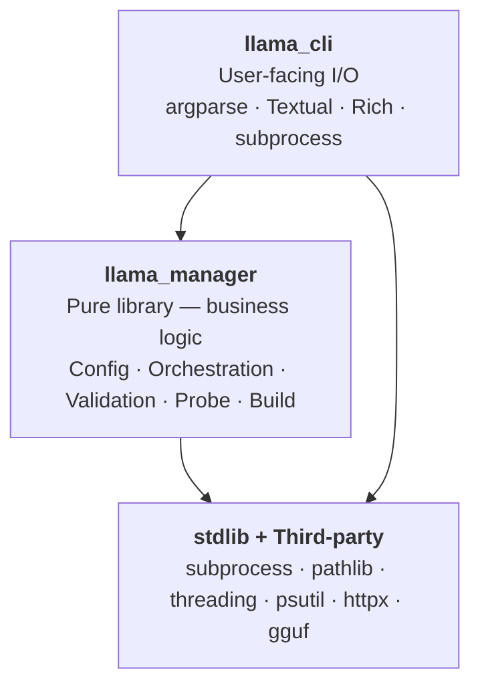
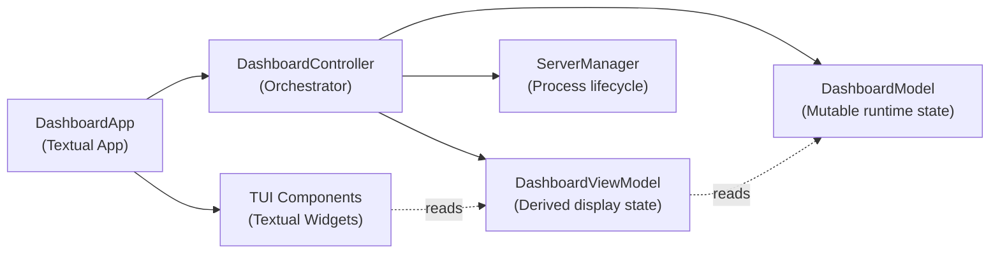
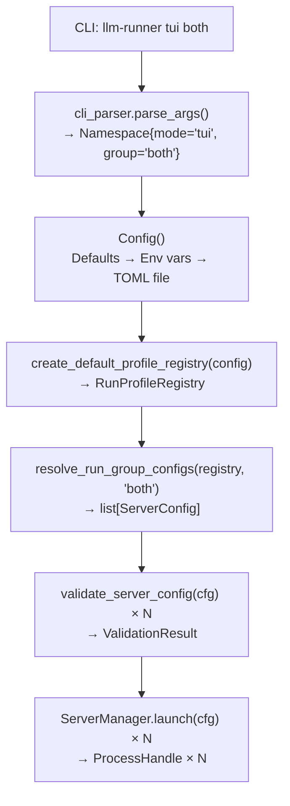
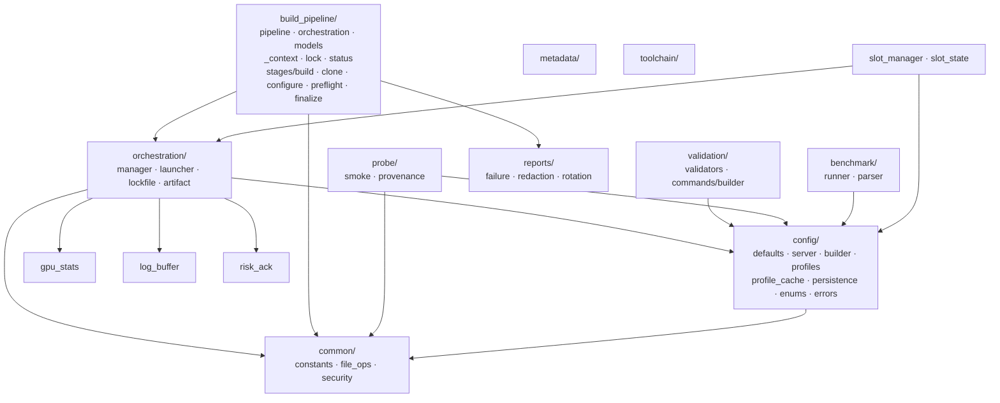
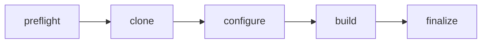

# llm-runner — Architecture Reference

> **Audience:** Developers and AI agents (Copilot, OpenCode) maintaining this codebase.
> **Scope:** `src/` only. Shell scripts, `specs/`, and `docs/plans/` are out of scope.
> **Related:** llama.cpp build paths, toolchain, and pipeline stages — [docs/build/README.md](build/README.md) (XDG layout and workstation setup).
> **Last updated:** 2026-05-19

---

## Table of Contents

1. [Project Overview](#1-project-overview)
2. [Repository Layout](#2-repository-layout)
3. [Layer Architecture](#3-layer-architecture)
4. [llama\_cli — CLI & TUI Layer](#4-llama_cli--cli--tui-layer)
5. [llama\_manager — Library Layer](#5-llama_manager--library-layer)
6. [TUI Architecture (MVVM)](#6-tui-architecture-mvvm)
7. [Data Models](#7-data-models)
8. [Config System](#8-config-system)
9. [Design Patterns](#9-design-patterns)
10. [CLI Command Tree](#10-cli-command-tree)
11. [External Dependencies](#11-external-dependencies)
12. [Test Architecture](#12-test-architecture)
13. [Inter-Module Dependency Graph](#13-inter-module-dependency-graph)
14. [llama.cpp Build System](#14-llamacpp-build-system)
15. [Appendix](#15-appendix)

---

## 1. Project Overview

**llm-runner** is a Python 3.12 TUI application for managing multiple [llama.cpp](https://github.com/ggerganov/llama.cpp) inference server instances across heterogeneous GPU hardware. It provides:

- A live [Textual](https://textual.textualize.io/) terminal dashboard for log streaming, GPU stats, and config display
- A CLI for dry-runs, smoke testing, GPU profiling, and building llama.cpp from source
- A pure library layer (`llama_manager`) with typed config management, subprocess lifecycle, and risk-aware launch orchestration

### Hardware Targets

| Role | Hardware | Backend | Default Port |
|------|----------|---------|-------------|
| Summary models (Qwen 2.5-2B / 0.8B) | Intel Arc B580 | SYCL (`SYCL0`) | 8080, 8082 |
| Code / reasoning (Qwen 3.5-35B) | NVIDIA RTX 3090 | CUDA (`GPU 0`) | 8081 |

### Key Technologies

| Technology | Version | Role |
|-----------|---------|------|
| Python | ≥ 3.12 | Language |
| Textual | ≥ 8.2.5, < 9 | TUI framework |
| Rich | ≥ 15.0.0 | Renderables inside Textual |
| Loguru | ≥ 0.7.3 | Internal diagnostic logging |
| httpx | ≥ 0.28.1 | Async HTTP for smoke probes |
| psutil | ≥ 7.2.2 | CPU/memory/process stats |
| gguf | ≥ 0.19.0 | GGUF metadata extraction |
| uv | any | Package/virtualenv management |
| ruff | ≥ 0.15.12 | Linting + formatting |
| pyright | ≥ 1.1.409 | Static type checking |

---

## 2. Repository Layout

```
src/
├── llama_cli/                      # CLI & TUI layer — all user-facing I/O
│   ├── __init__.py                 # Re-exports: parse_args, parse_tui_args, run_cli
│   ├── cli_parser.py               # argparse: mode routing, subcommand args
│   ├── server_runner.py            # main() + cli_main() entry point; mode dispatcher
│   ├── colors.py                   # ANSI colour constants (legacy; prefer ui_output)
│   ├── gpu_collectors.py           # collect_nvtop_stats() — subprocess wrapper for nvtop
│   ├── ui_output.py                # emit_info/success/warn/error/plain/heading helpers
│   ├── commands/
│   │   ├── __init__.py
│   │   ├── _output.py              # JSON / plain output formatting helpers
│   │   ├── _subprocess.py          # Subprocess execution helpers for commands
│   │   ├── _toolchain.py           # Toolchain detection and filtering
│   │   ├── build.py                # build <backend> subcommand handler
│   │   ├── doctor.py               # doctor check|repair handler (M4 spec)
│   │   ├── dry_run.py              # dry-run <mode> — validate & preview without launch
│   │   ├── profile.py              # profile <slot_id> <flavor> — GPU benchmarking
│   │   ├── setup.py                # setup check|venv|clean-venv handler
│   │   └── smoke.py                # smoke — HTTP probe of running llama-server
│   └── tui/
│       ├── __init__.py
│       ├── constants.py            # TUI-specific constants
│       ├── controller.py           # DashboardController — orchestrates slots/builds/profiles
│       ├── dashboard_panels.tcss   # Textual CSS: server panel layout
│       ├── model.py                # DashboardModel — mutable runtime state
│       ├── modals.tcss             # Textual CSS: modal dialogs
│       ├── system_status.tcss      # Textual CSS: system status bar
│       ├── textual_app.py          # DashboardApp(App) — main Textual application
│       ├── textual_app.tcss        # Textual CSS: top-level layout
│       ├── types.py                # TypedDicts for TUI components
│       ├── viewmodel.py            # DashboardViewModel — display-only derived state
│       └── components/             # Textual widget components
│           ├── __init__.py
│           ├── build.py            # BuildModalScreen — multi-step build wizard
│           ├── config_modal.py     # Config modal display
│           ├── gpu_stats.py        # GPU stats widget
│           ├── gpu_telemetry.py    # GPU telemetry display
│           ├── menu.py             # Command menu widget
│           ├── modal.py            # Base modal utilities
│           ├── server_column.py    # Server column layout
│           ├── server_log.py       # Server log view
│           ├── slot_status.py      # Slot status indicator
│           ├── system_health.py    # System health dashboard panel
│           └── system_status.py    # System status bar widget
│
├── llama_manager/                  # Library layer — pure business logic, no I/O at module level
│   ├── __init__.py                 # Public API surface (re-exports)
│   ├── gpu_stats.py                # GPUStats — real-time GPU metrics with injectable collector
│   ├── log_buffer.py               # LogBuffer — thread-safe circular buffer with redaction
│   ├── logging_setup.py            # Loguru configuration for internal diagnostics
│   ├── risk_ack.py                 # RiskAckResult — risk evaluation and acknowledgement
│   ├── setup_venv.py               # venv creation and integrity checks
│   ├── slot_manager.py             # normalize_slot_port, register_and_start_slot
│   ├── slot_state.py               # compute_slot_transition() — pure state machine
│   ├── config/
│   │   ├── __init__.py             # Public API re-exports for entire config subsystem
│   │   ├── defaults.py             # Config dataclass — hardware defaults + env overrides
│   │   ├── server.py               # ServerConfig + ModelSlot dataclasses
│   │   ├── builder.py              # Factory functions: create_*_cfg(), resolve_run_group_configs()
│   │   ├── profiles.py             # RunProfileSpec, RunGroupSpec, RunProfileRegistry
│   │   ├── profile_cache.py        # ProfileRecord persistence + staleness detection
│   │   ├── persistence.py          # TOML config file I/O (XDG config path)
│   │   ├── enums.py                # StrEnums: ErrorCode, SlotState, SmokePhase, etc.
│   │   └── errors.py               # ErrorDetail, MultiValidationError, ValidationResult
│   ├── orchestration/
│   │   ├── manager.py              # ServerManager — subprocess lifecycle + lockfile + risk ack
│   │   ├── launcher.py             # ProcessHandle, ProcessLauncher protocols + DefaultProcessLauncher
│   │   ├── lockfile.py             # Lockfile creation, validation, concurrent-launch safety
│   │   └── artifact.py             # Artifact persistence (slots, launch state) with owner-only permissions
│   ├── validation/
│   │   ├── validators.py           # validate_port, validate_threads, detect_risky_operations
│   │   └── commands/
│   │       └── builder.py          # Run command validation (FR-007)
│   ├── build_pipeline/
│   │   ├── pipeline.py             # BuildPipeline — 5-stage orchestration (preflight → clone → configure → build → finalize)
│   │   ├── orchestration.py        # run_build_for_backend() — backend-specific coordination
│   │   ├── models.py               # BuildArtifact, BuildProgress, BuildResult, BuildLock, BuildBackend
│   │   ├── _context.py             # _BuildContext — shared mutable state with progress_callback
│   │   ├── lock.py                 # Build lock acquisition/release for concurrent safety
│   │   ├── status.py               # get_build_status() — build artifact/source/remote status
│   │   ├── utils.py                # Build environment helpers
│   │   └── stages/                 # Individual pipeline stages
│   │       ├── preflight.py        # Pre-flight checks (toolchain, disk space)
│   │       ├── clone.py            # Git clone/fetch llama.cpp sources
│   │       ├── configure.py        # CMake configuration with backend flags
│   │       ├── build.py            # cmake --build with real-time output streaming
│   │       └── finalize.py         # Binary provenance and artifact writing
│   ├── reports/                    # Build failure diagnostics
│   │   ├── __init__.py
│   │   ├── failure.py              # write_failure_report() — failure diagnostics
│   │   ├── redaction.py            # Report text redaction
│   │   └── rotation.py             # Log/rotation management
│   ├── probe/
│   │   ├── smoke.py                # probe_slot() — HTTP health checks (models + chat endpoints)
│   │   └── provenance.py           # Smoke result reporting and tracking
│   ├── benchmark/
│   │   ├── runner.py               # BenchmarkRunner — wraps llama-bench execution
│   │   └── parser.py               # Parses llama-bench JSON output → BenchmarkResult
│   ├── metadata/
│   │   ├── _binary.py              # GGUF binary format inspection
│   │   └── _reader.py              # GGUF metadata extraction
│   ├── toolchain/                  # Toolchain detection (gcc, cmake, SYCL, CUDA, oneAPI)
│   └── common/
│       ├── constants.py            # File-mode constants (owner-only permissions: 0o600)
│       ├── file_ops.py             # Atomic JSON writes and file operation helpers
│       └── security.py             # Sensitive key detection + log-line redaction
│
└── tests/                          # Unit tests — pure, no GPU, no subprocess
    ├── __init__.py
    ├── conftest.py                 # Shared fixtures: tmp_runtime_dir, mock collectors, etc.
    ├── helpers.py                  # Test utilities
    ├── test_logging_setup.py
    ├── test_ui_output.py
    ├── config/                     # Config parsing, builders, profiles
    ├── server/                     # ServerConfig, validators, command building
    ├── cli/                        # Argument parsing, dry-run, commands
    ├── smoke/                      # Smoke probe result parsing
    ├── tui/                        # DashboardModel, DashboardViewModel
    ├── runtime/                    # Lockfile, artifact I/O, runtime dir resolution
    ├── build/                      # Build pipeline + orchestration
    ├── slot/                       # Slot manager + state machine
    ├── support/                    # Security redaction, file ops, toolchain
    ├── system/                     # Doctor health checks
    └── fixtures/                   # Mock GGUF files, JSON test data
```

---

## 3. Layer Architecture

The project enforces a strict **one-way dependency** between three tiers:



### Enforcement Rules

| Rule | Details |
|------|---------|
| **One-way dependency** | `llama_cli` imports from `llama_manager`. `llama_manager` **never** imports from `llama_cli`. |
| **Library is I/O-free at module level** | No `argparse`, no `Rich`, no `Textual`, no subprocess calls at import time inside `llama_manager`. |
| **Subprocess via protocols** | All subprocess access in `llama_manager` goes through the `ProcessLauncher` protocol (injectable). |
| **UI output via `ui_output.py`** | All `emit_*` calls live in `llama_cli` only. `llama_manager` writes to `sys.stderr` for internal errors only. |
| **Validator boundary** | `validate_*` functions in `validation/validators.py` call `sys.exit(1)` on failure — they are the CLI boundary guard, not business logic. |

---

## 4. llama\_cli — CLI & TUI Layer

### Entry Points

| Symbol | File | Purpose |
|--------|------|---------|
| `cli_main()` | `server_runner.py` | Registered as `llm-runner` script in `pyproject.toml` |
| `main(args)` | `server_runner.py` | Core mode dispatcher; callable from tests |
| `DashboardApp` | `tui/textual_app.py` | `class DashboardApp(App[None])` — Textual root application |
| `launch_tui()` | `server_runner.py` | Configures and launches `DashboardApp` |

### Module Reference

#### `cli_parser.py`
Parses `sys.argv` into an `argparse.Namespace`. Defines these constants used throughout the CLI:

```python
COMMAND_MODES = ("build", "setup", "doctor")
RUNNABLE_TUI_MODES = ("summary-balanced", "summary-fast", "qwen35", "both")
VALID_MODES = (*RUNNABLE_TUI_MODES, *COMMAND_MODES)
```

Key functions:

| Function | Signature | Purpose |
|----------|-----------|---------|
| `parse_args()` | `(args: list[str]) → Namespace` | Top-level dispatcher |
| `parse_tui_args()` | `(args: list[str]) → Namespace` | TUI-specific flags (ports, etc.) |
| `_handle_build_case()` | `(args: list[str]) → Namespace` | Build backend + job flags |
| `_parse_setup_check_args()` | `(args: list[str]) → Namespace` | setup subcommand args |

#### `server_runner.py`
Routes parsed args to the correct handler. Also handles signal registration (`SIGINT`, `SIGTERM`) before launching the TUI.

```python
def main(args: list[str]) -> int:
    parsed = parse_args(args)
    match parsed.mode:
        case "tui":        launch_tui(parsed)
        case "dry-run":    _run_dry_run_mode(parsed, ...)
        case "build":      build.main(parsed)
        case "setup":      setup.main(parsed)
        case "smoke":      smoke.main(parsed)
        case "profile":    profile.main(parsed)
        case "doctor":     doctor.main(parsed)
```

#### `ui_output.py`
All user-facing terminal output goes through these helpers (no direct `print()` in business logic):

| Function | Colour | Prefix |
|----------|--------|--------|
| `emit_info(msg)` | cyan | `[INFO]` |
| `emit_success(msg)` | green | `[OK]` |
| `emit_warn(msg)` | yellow | `[WARN]` |
| `emit_error(msg)` | red | `[ERROR]` |
| `emit_plain(msg)` | — | none |
| `emit_heading(msg)` | bold white | `───` border |

#### `gpu_collectors.py`
Wraps `nvtop` subprocess calls to collect per-GPU stats for the TUI. Returns a `dict[int, dict[str, Any]]` keyed by device index.

```python
def collect_nvtop_stats() -> dict[int, dict[str, Any]]: ...
```

#### `commands/` Subcommand Handlers

| File | Handler | Subcommand |
|------|---------|------------|
| `dry_run.py` | `dry_run(target_mode, port1, port2, acknowledged)` | `dry-run <mode>` |
| `build.py` | `main(parsed)` | `build <backend>` |
| `profile.py` | `main(parsed)` | `profile <slot_id> <flavor>` |
| `smoke.py` | `main(parsed)` | `smoke [both | slot <id>]` |
| `setup.py` | `main(parsed)` | `setup check|venv|clean-venv` |
| `doctor.py` | `main(parsed)` | `doctor check|repair` |
| `_output.py` | — | Shared JSON/plain output helpers |
| `_subprocess.py` | — | Shared subprocess execution helpers |
| `_toolchain.py` | — | Toolchain detection and filtering |

---

## 5. llama\_manager — Library Layer

### `config/` — Configuration Subsystem

The configuration system is the backbone of the application. All config flows through this package.

| File | Key Symbols | Purpose |
|------|------------|---------|
| `defaults.py` | `Config` | Hardware defaults + env var overrides |
| `server.py` | `ServerConfig`, `ModelSlot` | Per-instance launch parameters |
| `builder.py` | `create_*_cfg()`, `resolve_run_group_configs()` | Factory + merge logic |
| `profiles.py` | `RunProfileSpec`, `RunGroupSpec`, `RunProfileRegistry` | Named launch profiles and groups |
| `profile_cache.py` | `ProfileRecord`, `ProfileMetrics`, `load_profile_with_staleness()` | Benchmark caching + staleness |
| `persistence.py` | `load_config_toml()`, `save_config_toml()` | TOML config file at `$XDG_CONFIG_HOME/llm-runner/config.toml` |
| `enums.py` | `ErrorCode`, `SlotState`, `SmokePhase`, `ProfileFlavor`, `StalenessReason`, `DoctorCheckStatus` | All StrEnums |
| `errors.py` | `ErrorDetail`, `MultiValidationError`, `ValidationResult` | Structured error reporting |
| `__init__.py` | — | Re-exports entire config public API |

### `orchestration/` — Process Lifecycle

| File | Key Symbols | Purpose |
|------|------------|---------|
| `manager.py` | `ServerManager` | Subprocess lifecycle, lockfile management, risk ack tracking |
| `launcher.py` | `ProcessHandle`, `ProcessLauncher` (Protocols), `DefaultProcessLauncher` | Subprocess abstraction |
| `lockfile.py` | `create_lock()`, `release_lock()`, `validate_lock()` | Concurrent-launch safety via JSON lockfiles |
| `artifact.py` | `write_artifact()`, `read_artifact()` | Owner-only (0o600) JSON artifact I/O |

`ServerManager` public API:

```python
class ServerManager:
    def launch(self, cfg: ServerConfig) -> ProcessHandle: ...
    def poll_all(self) -> dict[str, ProcessHandle | None]: ...
    def create_lock(self, slots: list[ModelSlot]) -> None: ...
    def release_lock(self) -> None: ...
    def is_risk_acknowledged(self, alias: str, risk: str, launch_id: str) -> bool: ...
```

### `validation/` — Input Validation

`validation/validators.py` — validators are **CLI boundary guards** that call `sys.exit(1)` on failure:

```python
def validate_port(port: int) -> ValidationResult: ...
def validate_threads(threads: int) -> ValidationResult: ...
def validate_ports(ports: list[int]) -> ValidationResult: ...
def detect_risky_operations(cfg: ServerConfig) -> list[str]: ...
```

`validation/commands/builder.py` validates that a constructed server command meets FR-007 requirements before launch.

### `build_pipeline/` — llama.cpp Build Orchestration

5-stage pipeline: **preflight → clone → configure → build → finalize**. Stage behavior, CMake flags, paths, and operator docs: [docs/build/pipeline-stages.md](build/pipeline-stages.md).

| File | Key Symbols | Purpose |
|------|------------|---------|
| `pipeline.py` | `BuildPipeline` | 5-stage orchestration; `run()` per backend; `run_both_backends()` for tests only |
| `orchestration.py` | `run_build_for_backend()` | TUI/CLI path: derives `build` / `build_cuda` dirs and `builds_dir/<backend>` |
| `models.py` | `BuildArtifact`, `BuildProgress`, `BuildResult`, `BuildLock`, `BuildBackend` | Build state dataclasses |
| `_context.py` | `_BuildContext` | Shared mutable state across stages; `progress_callback` for real-time TUI updates |
| `lock.py` | `acquire_lock()`, `release_lock()` | Build lock for concurrent safety |
| `status.py` | `get_build_status()` | Build artifact/source/remote status for TUI |
| `utils.py` | `get_build_env_cmd()` | SYCL oneAPI `setvars.sh` wrapper for cmake invocations |
| `stages/build.py` | `run_build()`, `_run_build_subprocess()` | cmake --build with real-time output streaming |
| `stages/clone.py` | `run_clone()` | Git clone/fetch llama.cpp sources |
| `stages/configure.py` | `run_configure()`, `get_cmake_flags()` | CMake configuration with backend flags |
| `stages/preflight.py` | `run_preflight()` | Toolchain validation via `detect_toolchain()` |
| `stages/finalize.py` | `run_finalize()` | Binary discovery and `build-artifact.json` provenance |

### `probe/` — Smoke Testing

| File | Key Symbols | Purpose |
|------|------------|---------|
| `smoke.py` | `probe_slot()` | HTTP health checks: listen → models → chat phases |
| `provenance.py` | `SmokeProbeResult`, `SmokeReport` | Result reporting and tracking |

`probe_slot()` uses `httpx` async requests to verify a running `llama-server` instance through:
1. **LISTEN** — TCP port reachable
2. **MODELS** — `/v1/models` returns expected model
3. **CHAT** — `/v1/chat/completions` returns valid tokens

### `benchmark/` — GPU Profiling

| File | Key Symbols | Purpose |
|------|------------|---------|
| `runner.py` | `BenchmarkRunner` | Wraps `llama-bench` subprocess execution |
| `parser.py` | `parse_bench_output()` | Parses `llama-bench --output json` → `BenchmarkResult` |

### `metadata/` — GGUF Introspection

| File | Key Symbols | Purpose |
|------|------------|---------|
| `_binary.py` | `inspect_gguf_binary()` | GGUF binary format validation |
| `_reader.py` | `read_gguf_metadata()` | Extracts model name, architecture, quantization from GGUF header |

### `common/` — Cross-Cutting Utilities

| File | Key Symbols | Purpose |
|------|------------|---------|
| `constants.py` | `FILE_MODE_OWNER_ONLY = 0o600` | Security-relevant file permission constants |
| `file_ops.py` | `atomic_write_json()`, `read_json()` | Atomic JSON writes (write-to-temp + rename) |
| `security.py` | `redact_sensitive_line()`, `is_sensitive_key()` | Masks API keys, tokens in log output |

### `toolchain/` — Build Tool Detection

Detects presence and versions of: `gcc`, `g++`, `cmake`, `ninja`, `icpx` (Intel oneAPI), `nvcc` (CUDA). Exposes a typed `ToolchainReport` dataclass.

### `gpu_stats.py` / `log_buffer.py` / `logging_setup.py`

| Symbol | Location | Purpose |
|--------|----------|---------|
| `GPUStats` | `gpu_stats.py` | Real-time GPU metrics; injectable `_collector` callable |
| `LogBuffer` | `log_buffer.py` | Thread-safe `deque`-based circular buffer with mutex + redaction |
| `configure_logging()` | `logging_setup.py` | Loguru sink setup for `~/.local/share/llm-runner/llm-runner.log` |

### `slot_manager.py` / `slot_state.py`

| Symbol | File | Purpose |
|--------|------|---------|
| `normalize_slot_port()` | `slot_manager.py` | Canonicalizes slot port to string key |
| `device_class_for_config()` | `slot_manager.py` | Returns `"intel"` or `"nvidia"` from `ServerConfig.device` |
| `register_and_start_slot()` | `slot_manager.py` | Full slot registration + launch in one call |
| `compute_slot_transition()` | `slot_state.py` | Pure function: `(slot_id, old_state, new_state) → (message, css_class) \| None` |

---

## 6. TUI Architecture (MVVM)

The TUI follows an **MVVM** (Model-View-ViewModel) separation pattern:



### `DashboardModel` (`tui/model.py`)
Holds **all mutable state** for the dashboard. No UI objects — pure data.

Key fields: `config: Config`, `configs: list[ServerConfig]`, `slots: list[ModelSlot]`, `log_buffers: dict[str, LogBuffer]`, `gpu_stats: list[GPUStats]`, `slot_states: dict[str, str]`, `server_manager: ServerManager`, `launch_result: LaunchResult | None`, `risk_prompt: RiskPromptState | None`, `profile_status: dict[str, str]`, build state, smoke state.

### `DashboardViewModel` (`tui/viewmodel.py`)
Derives **immutable display state** from the model. Only reading, no mutation.

Key methods: `command_menu() → list[tuple]`, `gpu_telemetry_lines() → list[str]`, `server_column_count() → int`, `build_selected_backends → list[str]`.

### `DashboardController` (`tui/controller.py`)
Binds model, viewmodel, and app. Owns all async coordination:
- Starts/stops server slots
- Triggers build pipeline runs
- Triggers GPU benchmark profiles
- Handles `RiskAckResult` prompts
- Polls process states and updates `DashboardModel`

### `DashboardApp` (`tui/textual_app.py`)
Textual `App[None]` subclass. Manages:
- TCSS stylesheet loading (`textual_app.tcss`, `dashboard_panels.tcss`, `modals.tcss`, `system_status.tcss`)
- Key bindings (action map)
- Widget composition
- Signal handler registration (`SIGINT`, `SIGTERM` → graceful shutdown)

### Component Hierarchy (simplified)

```
DashboardApp
├── Header (Textual built-in)
   ├── SystemStatusBar          # GPU stats, slot health indicators
    ├── SystemHealthPanel        # Comprehensive system health dashboard
├── Horizontal
│   ├── ServerPanel (×N)     # Per-slot: log stream + config overlay
│   │   ├── LogView          # Rich-based scrolling log
│   │   └── ConfigPanel      # Resolved config display
│   └── SidePanel            # GPU telemetry, profile results
├── Footer (Textual built-in)
└── Modals (on demand)
    ├── RiskAckModal         # Risk acknowledgement prompt
    ├── BuildModal           # Build progress overlay
    └── ProfileModal         # Benchmark results
```

---

## 7. Data Models

### Configuration Dataclasses

#### `Config` — `llama_manager/config/defaults.py`

Hardware-specific defaults loaded from code defaults → environment variables → TOML file.

| Field | Type | Default / Source |
|-------|------|-----------------|
| `llama_cpp_root` | `str` | `$LLAMA_CPP_ROOT` or `~/llama.cpp` |
| `llama_server_bin_intel` | `str` | `$LLAMA_SERVER_BIN_INTEL` |
| `llama_server_bin_nvidia` | `str` | `$LLAMA_SERVER_BIN_NVIDIA` |
| `models_dir` | `str` | `$MODELS_DIR` or `~/models` |
| `host` | `str` | `"127.0.0.1"` |
| `summary_balanced_port` | `int` | `8080` |
| `summary_fast_port` | `int` | `8082` |
| `qwen35_port` | `int` | `8081` |
| `venv_path` | `str` (property) | `{llama_cpp_root}/.venv` |
| `builds_dir` | `str` (property) | `$XDG_CACHE_HOME/llm-runner/builds` |
| `reports_dir` | `str` (property) | `$XDG_DATA_HOME/llm-runner/reports` |
| `profiles_dir` | `str` (property) | `$XDG_DATA_HOME/llm-runner/profiles` |

#### `ServerConfig` — `llama_manager/config/server.py`

Per-instance launch parameters for a single `llama-server` process.

| Field | Type | Notes |
|-------|------|-------|
| `model` | `str` | Absolute GGUF path |
| `alias` | `str` | Slot identifier (e.g., `"summary-balanced"`) |
| `device` | `str` | `"SYCL0"` or `"GPU 0"` |
| `port` | `int` | 1024–65535 |
| `ctx_size` | `int` | Context window size |
| `ubatch_size` | `int` | Micro-batch size |
| `threads` | `int` | CPU thread count |
| `bind_address` | `str` | Default: `"127.0.0.1"` |
| `n_gpu_layers` | `int \| str` | Supports `"all"` for CUDA |
| `cache_type_k` | `str` | KV cache quantization: `"q8_0"` |
| `cache_type_v` | `str` | KV cache quantization: `"q8_0"` |
| `tensor_split` | `str` | Multi-GPU split spec |
| `reasoning_mode` | `str` | `"auto"`, `"enabled"`, `"disabled"` |
| `reasoning_format` | `str` | `"none"`, `"deepseek"` |
| `server_bin` | `str` | Binary path override (falls back to `Config` default) |
| `risky_acknowledged` | `list[str]` | Risk IDs the user has explicitly accepted |

#### `ModelSlot` — `llama_manager/config/server.py`

Lightweight reference used by `ServerManager` and lockfiles.

```python
@dataclass
class ModelSlot:
    slot_id: str       # Normalized slot ID (alias + port)
    model_path: str    # Absolute GGUF path
    port: int
```

### Profile Dataclasses

#### `RunProfileSpec` — `llama_manager/config/profiles.py`

Immutable, frozen, slotted profile definition. Mirrors `ServerConfig` fields but stored as a named profile.

```python
@dataclass(frozen=True, slots=True)
class RunProfileSpec:
    profile_id: str
    model: str
    alias: str
    device: str
    port: int
    ctx_size: int
    ubatch_size: int
    threads: int
    description: str = ""
    risky_acknowledged: tuple[str, ...] = ()
    # ... (all other ServerConfig-equivalent fields)
```

#### `RunGroupSpec` — `llama_manager/config/profiles.py`

A named launch group referencing one or more profiles.

```python
@dataclass(frozen=True, slots=True)
class RunGroupSpec:
    group_id: str                    # "both", "summary-balanced", etc.
    profile_ids: tuple[str, ...]     # Profiles to launch
    description: str = ""
    tui_enabled: bool = True
```

#### `RunProfileRegistry` — `llama_manager/config/profiles.py`

Immutable container for all profiles and run groups.

```python
@dataclass(frozen=True, slots=True)
class RunProfileRegistry:
    profiles: tuple[RunProfileSpec, ...]
    run_groups: tuple[RunGroupSpec, ...]

    def get_profile(self, profile_id: str) -> RunProfileSpec: ...
    def get_run_group(self, group_id: str) -> RunGroupSpec: ...
```

#### `ProfileRecord` / `ProfileMetrics` — `llama_manager/config/profile_cache.py`

Cached benchmark results with staleness metadata.

```python
@dataclass(frozen=True, slots=True)
class ProfileMetrics:
    tokens_per_second: float
    avg_latency_ms: float
    peak_vram_mb: float | None

@dataclass(frozen=True, slots=True)
class ProfileRecord:
    profile_id: str
    device: str
    flavor: ProfileFlavor
    metrics: ProfileMetrics
    schema_version: str
    timestamp: str            # ISO 8601
    driver_version_hash: str  # sha256(driver version + device ID)
    binary_version_hash: str  # sha256(binary path + mtime)
```

### Error Dataclasses — `llama_manager/config/errors.py`

```python
@dataclass
class ErrorDetail:
    error_code: ErrorCode
    failed_check: str    # What failed
    why_blocked: str     # Why it blocks launch
    how_to_fix: str      # Action for user

@dataclass
class MultiValidationError:
    errors: list[ErrorDetail]

@dataclass
class ValidationResult:
    passed: bool
    error_code: ErrorCode | None
    error_message: str | None
```

### Build Pipeline Dataclasses — `llama_manager/build_pipeline/models.py`

```python
@dataclass
class BuildArtifact:
    artifact_type: Literal["llama-server"]
    backend: BuildBackend           # SYCL, CUDA, BOTH
    created_at: float
    git_remote_url: str
    git_commit_sha: str
    git_branch: str
    build_command: list[str]
    build_duration_seconds: float
    exit_code: int
    binary_path: Path | None
    binary_size_bytes: int | None
    build_log_path: Path | None
    failure_report_path: Path | None

    @property
    def is_success(self) -> bool     # exit_code == 0
    @property
    def binary_size_mb(self) -> float | None

@dataclass
class BuildProgress:
    stage: str                       # "preflight", "clone", "configure", "build", "finalize"
    status: str                      # "running", "success", "failed", "retrying", "skipped"
    message: str
    progress_percent: float
    retries_remaining: int | None    # Non-null when status == "retrying"
    output_line: str | None          # Real-time compiler output line

    @property
    def is_complete(self) -> bool    # status in {success, failed, skipped}
    @property
    def is_retrying(self) -> bool    # status == "retrying" and retries_remaining is not None

@dataclass
class BuildLock:
    pid: int                         # Process ID holding the lock
    started_at: float                # Monotonic timestamp
    backend: str                     # BuildBackend value

    @property
    def elapsed_seconds(self) -> float
    def is_stale(self, timeout_seconds: int = 3600) -> bool
```

### TUI Types — `llama_cli/tui/types.py`

```python
@dataclass
class BuildWizardResult:
    backends: list[str]              # ["sycl"], ["cuda"], or ["sycl", "cuda"]
    options: dict[str, BuildConfig | None]  # Per-backend BuildConfig overrides
```

### Runtime Dataclasses

```python
# orchestration/manager.py
@dataclass
class LaunchResult:
    success: bool
    slot_id: str
    message: str

# risk_ack.py
@dataclass
class RiskAckResult:
    has_risks: bool
    risks_acknowledged: bool
    risk_details: list[dict[str, Any]]  # {alias, risk, risk_kind}
```

### Enums (all `StrEnum`) — `llama_manager/config/enums.py`

| Enum | Values |
|------|--------|
| `ErrorCode` | `FILE_NOT_FOUND`, `PORT_INVALID`, `THREADS_INVALID`, `LOCKFILE_INTEGRITY_FAILURE`, `ARTIFACT_PERSISTENCE_FAILURE`, `BINARY_NOT_FOUND`, `MODEL_NOT_FOUND`, `RISK_NOT_ACKNOWLEDGED`, … |
| `SlotState` | `IDLE`, `LAUNCHING`, `RUNNING`, `DEGRADED`, `CRASHED`, `OFFLINE` |
| `SmokePhase` | `LISTEN`, `MODELS`, `CHAT`, `COMPLETE` |
| `SmokeFailurePhase` | `LISTEN`, `MODELS`, `CHAT` |
| `SmokeProbeStatus` | `PASS`, `FAIL`, `TIMEOUT`, `CRASHED`, `MODEL_NOT_FOUND`, `AUTH_FAILURE` |
| `ProfileFlavor` | `BALANCED`, `FAST`, `QUALITY` |
| `StalenessReason` | `DRIVER_CHANGED`, `BINARY_CHANGED`, `AGE_EXCEEDED` |
| `DoctorCheckStatus` | `PASS`, `WARN`, `FAIL` |

---

## 8. Config System

### Full Configuration Flow



### Precedence Order (FR-006)

Config values are resolved in this order (later entries win):

```
1. Hardcoded defaults  (Config dataclass field defaults)
2. Environment vars    ($LLAMA_CPP_ROOT, $MODELS_DIR, $LLM_RUNNER_RUNTIME_DIR, …)
3. TOML config file    ($XDG_CONFIG_HOME/llm-runner/config.toml)
4. Profile config      (RunProfileSpec fields)
5. CLI overrides       (--port, --threads, --ctx-size, etc.)
```

Deep-merge is implemented in `config/builder.py` via `_deep_merge()` which recursively merges dicts, with later sources overriding earlier ones.

### Factory Functions (`config/builder.py`)

| Function | Signature | Returns |
|----------|-----------|---------|
| `create_summary_balanced_cfg()` | `(port: int \| None = None, **kwargs) → ServerConfig` | SYCL 2B model |
| `create_summary_fast_cfg()` | `(port: int \| None = None, **kwargs) → ServerConfig` | SYCL 0.8B model |
| `create_qwen35_cfg()` | `(port: int \| None = None, **kwargs) → ServerConfig` | CUDA 35B model |
| `create_server_config_from_profile()` | `(profile: RunProfileSpec, port_override: int \| None) → ServerConfig` | Hydrate profile → config |
| `resolve_run_group_configs()` | `(registry: RunProfileRegistry, group_id: str, ...) → list[ServerConfig]` | All configs for a run group |
| `resolve_profile_config()` | `(registry: RunProfileRegistry, profile_id: str) → ServerConfig` | Single profile config |
| `merge_config_overrides()` | `(base: dict, override: dict) → dict` | Deep-merge two config dicts |
| `apply_profile_overrides()` | `(base_cfg: ServerConfig, overrides: dict) → ServerConfig` | Apply override dict to config |

### Default Profile Registry

Created by `create_default_profile_registry(cfg: Config)`:

```
registry.profiles:
  "summary-balanced"  → Intel SYCL · Qwen 2.5-2B  · port 8080
  "summary-fast"      → Intel SYCL · Qwen 2.5-0.8B · port 8082
  "qwen35"            → NVIDIA CUDA · Qwen 3.5-35B · port 8081

registry.run_groups:
  "both"               → ("summary-balanced", "qwen35")
  "summary-balanced"   → ("summary-balanced",)
  "summary-fast"       → ("summary-fast",)
  "qwen35"             → ("qwen35",)
```

### Profile Staleness Tracking

`load_profile_with_staleness()` returns a `StalenessResult` indicating whether the cached benchmark profile is stale:

| Staleness Reason | Trigger |
|-----------------|---------|
| `DRIVER_CHANGED` | `sha256(GPU driver version + device ID)` changed |
| `BINARY_CHANGED` | `sha256(llama-server binary path + mtime)` changed |
| `AGE_EXCEEDED` | Profile is older than configured TTL |

### Runtime Directory Resolution

```python
runtime_dir = (
    os.environ.get("LLM_RUNNER_RUNTIME_DIR")
    or os.environ.get("XDG_RUNTIME_DIR", "") + "/llm-runner"
    or f"/tmp/llm-runner-{os.getuid()}"
)
```

Files written here: `lockfile.json`, `slots.json`, `launch_state.json`.

---

## 9. Design Patterns

### Factory Pattern
**Location:** `llama_manager/config/builder.py`

Factory functions translate a `Config` into `ServerConfig` for a given mode. Each function sets hardware-specific defaults (SYCL vs CUDA, model path, port, thread count) and accepts `**kwargs` for test overrides.

### Deep-Merge Pattern
**Location:** `llama_manager/config/builder.py` → `_deep_merge()`

Config precedence (FR-006) is enforced by recursive dict merging. Callers compose config from multiple sources in priority order, then call `_deep_merge()`.

### Registry Pattern
**Location:** `llama_manager/config/profiles.py`

`RunProfileRegistry` holds immutable `tuple[RunProfileSpec, ...]` and `tuple[RunGroupSpec, ...]`. All lookups go through `.get_profile()` / `.get_run_group()` which raise `KeyError` on miss.

### Manager Pattern
**Location:** `llama_manager/orchestration/manager.py`

`ServerManager` centralizes subprocess lifecycle, lockfile creation, and risk acknowledgement state. Accepts an injectable `ProcessLauncher` to decouple subprocess from business logic.

### Validator Boundary Pattern
**Location:** `llama_manager/validation/validators.py`

Validators are CLI boundary guards. They call `sys.exit(1)` after writing to `sys.stderr` — they are not business logic and must not be wrapped in `try/except` in production code. Tests use `pytest.raises(SystemExit)`.

### Injectable Collector Pattern
**Location:** `llama_manager/gpu_stats.py`

`GPUStats` accepts an optional `collector: Callable[[], dict[str, Any]]`. The default is a psutil-based fallback. Tests inject a mock collector to avoid GPU hardware dependency.

```python
class GPUStats:
    def __init__(self, device_index: int, collector: Callable | None = None):
        self._collector = collector or _psutil_only_collector
```

### Protocol-Based Abstraction
**Location:** `llama_manager/orchestration/launcher.py`

`ProcessHandle` and `ProcessLauncher` are `typing.Protocol` definitions. `DefaultProcessLauncher` wraps `subprocess.Popen`. Tests inject `MockProcessLauncher` with no real subprocess.

### Atomic File Writes
**Location:** `llama_manager/common/file_ops.py`

All JSON artifact writes use write-to-temp-file + `os.replace()` for atomicity. Combined with `0o600` permissions (owner-only) for security-sensitive files.

### Risk Acknowledgement Tracking
**Location:** `llama_manager/risk_ack.py` + `orchestration/manager.py`

`evaluate_risks()` returns an immutable `RiskAckResult`. Risk acknowledgements are tracked per `(alias, risk_kind, launch_id)` triplet to prevent stale acks from applying to new launches.

### Slot State Machine
**Location:** `llama_manager/slot_state.py`

`compute_slot_transition()` is a pure function with no side effects:
```python
def compute_slot_transition(
    slot_id: str,
    old_state: str | None,
    new_state: SlotState,
) -> tuple[str, str] | None:
    # Returns (message, css_class) or None if no UI update needed
```

### MVVM Separation
**Location:** `llama_cli/tui/`

| Component | Role | Mutates? |
|-----------|------|---------|
| `DashboardModel` | All runtime state | Yes — owned by Controller |
| `DashboardViewModel` | Display derivation | No — reads Model only |
| `DashboardController` | Orchestration logic | Yes — mutates Model |
| `DashboardApp` + Widgets | Rendering | No — reads ViewModel |

---

## 10. CLI Command Tree

```
llm-runner
│
├── tui <mode> [--port N] [--port2 N] [--acknowledge-risky]
│   ├── summary-balanced      Intel SYCL · Qwen 2.5-2B  · port 8080
│   ├── summary-fast          Intel SYCL · Qwen 2.5-0.8B · port 8082
│   ├── qwen35                NVIDIA CUDA · Qwen 3.5-35B · port 8081
│   ├── qwen27b               NVIDIA CUDA · Qwen 3.6-27B · port 8081
│   └── both                  summary-balanced + qwen35 side-by-side
│       Handler: server_runner.launch_tui()
│
├── dry-run <mode> [--port N] [--port2 N] [--acknowledge-risky]
│   ├── Validates all configs without launching
│   ├── Writes dry-run artifacts to runtime dir
│   ├── Detects risky operations and reports them
│   └── Shows resolved llama-server commands
│       Handler: commands/dry_run.dry_run()
│
├── smoke [both | slot <slot-id>]
│       [--json] [--api-key KEY] [--max-tokens N]
│       [--prompt TEXT] [--delay S] [--timeout S]
│   ├── Probes each slot: LISTEN → MODELS → CHAT
│   └── Outputs structured SmokeProbeResult (JSON or human-readable)
│       Handler: commands/smoke.main()
│
├── profile <slot_id> <flavor> [--json]
│   ├── <flavor>: balanced | fast | quality
│   ├── Runs llama-bench against the slot
│   ├── Stores ProfileRecord (with driver/binary hash for staleness)
│   └── Returns ProfileMetrics
│       Handler: commands/profile.main()
│
├── build <backend> [--dry-run] [-j N]
│   ├── <backend>: sycl | cuda | both (serialized: SYCL then CUDA)
│   ├── Clones/updates llama.cpp under $XDG_CACHE_HOME/llm-runner/llama.cpp (or LLAMA_CPP_ROOT)
│   ├── Configures cmake → <source>/build or <source>/build_cuda
│   ├── Compiles llama-server (parallel with -j N)
│   ├── Binaries: build/bin/llama-server (SYCL), build_cuda/bin/llama-server (CUDA)
│   └── Provenance: $XDG_STATE_HOME/llm-runner/builds/<backend>/build-artifact.json
│       Handler: commands/build.main()
│
├── setup <subcommand>
│   ├── check [sycl|cuda|all] [--json]   Check toolchain availability
│   ├── venv                              Create/reuse virtual environment
│   └── clean-venv                        Remove virtual environment
│       Handler: commands/setup.main()
│
└── doctor <subcommand>           (M4 spec — partially implemented)
    ├── check                     System health diagnostics
    └── repair                    Auto-fix detected issues
        Handler: commands/doctor.main()
```

### Argument Parsing Flow

```mermaid
flowchart LR
    A["sys.argv"] --> B["cli_parser.parse_args()"]
    B --> C{argv[1]}
    C -->|tui| D["parse_tui_args()\n→ mode + ports"]
    C -->|dry-run| E["parse_dry_run_args()\n→ mode + ports + ack"]
    C -->|build| F["_handle_build_case()\n→ backend + -j"]
    C -->|setup| G["_parse_setup_check_args()\n→ subcommand + flags"]
    C -->|smoke| H["_parse_smoke_args()\n→ mode + probe opts"]
    C -->|profile| I["_parse_profile_args()\n→ slot_id + flavor"]
    D & E & F & G & H & I --> J["Namespace → server_runner.main()"]
    J --> K["Route to handler"]
```

---

## 11. External Dependencies

### Runtime Dependencies

| Package | Version Constraint | Where Used |
|---------|-------------------|------------|
| `loguru` | ≥ 0.7.3 | `llama_manager/logging_setup.py` — internal diagnostics only |
| `rich` | ≥ 15.0.0 | TUI renderables (spinners, tables, progress bars) inside Textual |
| `textual` | ≥ 8.2.5, < 9 | `llama_cli/tui/` — entire TUI framework |
| `psutil` | ≥ 7.2.2 | `gpu_stats.py` (fallback GPU stats), `slot_manager.py` (process inspection) |
| `httpx` | ≥ 0.28.1 | `llama_manager/probe/smoke.py` — async HTTP smoke probes |
| `gguf` | ≥ 0.19.0 | `llama_manager/metadata/_reader.py` — GGUF metadata extraction |

### Dev Dependencies

| Package | Version | Purpose |
|---------|---------|---------|
| `pytest` | ≥ 9.0.3 | Test framework |
| `pytest-cov` | ≥ 7.1.0 | Coverage reporting (`coverage.xml`) |
| `ruff` | ≥ 0.15.12 | Linting (E/W/F/I/UP/B/C4/SIM/S rules) + formatting |
| `pyright` | ≥ 1.1.409 | Static type checking (standard mode) |
| `pre-commit` | ≥ 4.6.0 | Git hook runner (ruff + pyright on every commit) |
| `pip-audit` | ≥ 2.10.0 | CVE scanning for transitive dependencies |

### Key Stdlib Usage

| Module | Where Used |
|--------|-----------|
| `subprocess` | `orchestration/launcher.py`, `gpu_collectors.py`, `benchmark/runner.py` |
| `threading` | `log_buffer.py` (mutex), TUI background polling |
| `pathlib.Path` | All file I/O throughout `llama_manager` |
| `json` | Config/artifact I/O in `common/file_ops.py`, `orchestration/artifact.py` |
| `dataclasses` | All major data types |
| `enum.StrEnum` | All enums in `config/enums.py` |
| `argparse` | `llama_cli/cli_parser.py` only |
| `signal` | `llama_cli/server_runner.py` — SIGINT/SIGTERM handling |
| `os.replace` | `common/file_ops.py` — atomic file writes |
| `hashlib.sha256` | `config/profile_cache.py` — staleness detection |

---

## 12. Test Architecture

### Test Organization

```
src/tests/
├── conftest.py              # Shared fixtures (described below)
├── helpers.py               # Reusable test utilities
├── test_logging_setup.py    # Loguru configuration tests
├── test_ui_output.py        # emit_* output helper tests
│
   ├── config/                  # Config subsystem unit tests
    │   ├── __init__.py
    │   ├── test_config_builders.py  # Factory functions, deep-merge, FR-006 precedence
    │   ├── test_config_persistence.py # TOML load/save round-trips
    │   └── test_profile_cache.py    # Staleness detection, ProfileRecord persistence
    │
    ├── server/                  # ServerConfig + build command
    │   ├── __init__.py
    │   ├── test_server.py           # ServerConfig, validators, command building
    │   ├── test_dry_run_artifacts.py
    │   └── test_dry_run_schema.py
    │
    ├── cli/                     # Argument parsing + subcommands
    │   ├── __init__.py
    │   ├── conftest.py
    │   ├── test_cli_parser.py
    │   ├── test_entry_points.py
    │   ├── test_build_cli.py
    │   ├── test_doctor_check.py
    │   ├── test_profile_cli.py
    │   ├── test_server_runner.py
    │   ├── test_setup_cli.py
    │   └── test_smoke_cli_execution.py
    │
    ├── smoke/                   # HTTP probe
    │   ├── __init__.py
    │   ├── test_probe_config_models.py
    │   └── test_smoke_lifecycle.py
    │
    ├── tui/                     # TUI model/viewmodel (no Textual rendering)
    │   ├── __init__.py
    │   └── test_tui.py
    │
    ├── runtime/                 # Lockfile + artifact I/O
    │   ├── __init__.py
    │   ├── test_audit_redaction.py
    │   ├── test_launcher.py
    │   └── test_launch_flow.py
    │
    ├── build/                   # Build pipeline stages
    │   ├── __init__.py
    │   ├── test_build_config.py
    │   ├── test_pipeline_clone_sources.py
    │   ├── test_pipeline_orchestration.py
    │   └── test_pipeline_status.py
    │
    ├── slot/                    # Slot lifecycle + state machine
    │   ├── __init__.py
    │   └── test_slot_manager.py
    │
    ├── support/                 # Cross-cutting utilities
    │   ├── __init__.py
    │   └── helpers.py
    │
    ├── system/                  # Doctor, toolchain, system checks
    │   ├── __init__.py
    │   ├── test_benchmark.py
    │   ├── test_foundation_contracts.py
    │   ├── test_gpu_collectors.py
    │   ├── test_metadata.py
    │   ├── test_performance.py
    │   ├── test_reports.py
    │   ├── test_setup_toolchain.py
    │   └── test_toolchain.py
    │
    └── fixtures/                # Static test data
        ├── *.gguf               # Minimal GGUF files for metadata tests
        └── mock_data.json
```

### Shared Fixtures (`conftest.py`)

| Fixture | Type | Scope | Purpose |
|---------|------|-------|---------|
| `tmp_runtime_dir` | `Path` | function | Isolated temp runtime directory |
| `sample_lockfile` | `Path` | function | Valid lockfile JSON in `tmp_runtime_dir` |
| `artifact_writer` | `Callable` | function | Helper to write arbitrary artifact JSON |
| `mock_gpu_collector` | `Callable` | function | Returns fixed GPU stats dict; no subprocess |
| `mock_server_launcher` | `MagicMock` | function | Fake `ProcessLauncher` protocol implementation |

### Testing Principles

1. **No subprocess spawning** — mock via `ProcessLauncher` protocol injection or `unittest.mock`
2. **No GPU hardware** — inject `mock_gpu_collector` into `GPUStats`; use psutil fallbacks
3. **No real file system side effects** — all file I/O via `tmp_path` fixture
4. **Validator testing** — use `pytest.raises(SystemExit)` with `assert exc.value.code == 1`
5. **Stderr capture** — use `capsys.readouterr().err` to assert validator messages
6. **Descriptive names** — `test_<what>_<condition>` naming convention

### Test Patterns

```python
# Validator exit path
def test_validate_port_out_of_range(capsys):
    with pytest.raises(SystemExit) as exc:
        validate_port(99999)
    assert exc.value.code == 1
    assert "PORT_INVALID" in capsys.readouterr().err

# Config round-trip
def test_config_deep_merge_overrides_port(tmp_path):
    base = create_summary_balanced_cfg()
    overridden = apply_profile_overrides(base, {"port": 9090})
    assert overridden.port == 9090
    assert overridden.alias == base.alias  # unchanged

# Injectable GPU collector
def test_gpu_stats_uses_injected_collector(mock_gpu_collector):
    stats = GPUStats(device_index=0, collector=mock_gpu_collector)
    result = stats.collect()
    assert result["vram_used_mb"] == mock_gpu_collector.return_value["vram_used_mb"]
```

---

## 13. Inter-Module Dependency Graph

### `llama_cli` → `llama_manager` Imports

```mermaid
graph TD
    SR["server_runner.py"]
    CP["cli_parser.py"]
    DR["commands/dry_run.py"]
    BLD["commands/build.py"]
    PRF["commands/profile.py"]
    SMK["commands/smoke.py"]
    STP["commands/setup.py"]
    CTRL["tui/controller.py"]
    MDL["tui/model.py"]

    MCFG["llama_manager/config"]
    MORCH["llama_manager/orchestration"]
    MVAL["llama_manager/validation"]
    MBLD["llama_manager/build_pipeline\n+ stages + _context + lock + status"]
    MPRB["llama_manager/probe"]
    MREP["llama_manager/reports\n+ failure + redaction + rotation"]
    MBNCH["llama_manager/benchmark"]
    MCOMM["llama_manager/common"]
    MGPU["llama_manager/gpu_stats"]
    MLOG["llama_manager/log_buffer"]
    MVENV["llama_manager/setup_venv"]
    MTOOL["llama_manager/toolchain"]
    MMETA["llama_manager/metadata"]

    SR --> MCFG
    SR --> MORCH
    CP --> MCFG
    DR --> MCFG
    DR --> MVAL
    DR --> MORCH
    BLD --> MBLD
    PRF --> MBNCH
    PRF --> MCFG
    SMK --> MCFG
    SMK --> MPRB
    STP --> MVENV
    STP --> MTOOL
    CTRL --> MCFG
    CTRL --> MORCH
    CTRL --> MBLD
    CTRL --> MBNCH
    CTRL --> MREP
    MDL --> MGPU
    MDL --> MLOG
    MDL --> MCFG
    MDL --> MORCH
```



### Internal `llama_manager` Dependency Flow



### No Circular Dependencies

The graph is a **DAG** (directed acyclic graph). Key guarantees:
- `llama_manager` → `llama_cli`: **never** (enforced by code review and CI)
- Within `llama_manager`: `config/` has no upward dependencies; all other sub-packages depend on `config/` and/or `common/`
- `common/` depends only on stdlib

---

## 14. llama.cpp Build System

`llama_manager/build_pipeline/` clones and compiles upstream llama.cpp for **SYCL** (Intel Arc) and **CUDA** (NVIDIA). Compiled `llama-server` binaries stay under the source tree; provenance JSON and build logs live under XDG state. Launch resolves binaries via `Config.llama_server_bin_intel` / `llama_server_bin_nvidia` (derived from `llama_cpp_root`).



| Entry point | Module |
|-------------|--------|
| CLI `build` | `llama_cli/commands/build.py` |
| TUI wizard | `llama_cli/tui/controller.py` → `run_build_for_backend()` |
| Library | `BuildPipeline.run()` |

### Path summary

| Artifact | Default location |
|----------|------------------|
| Source | `$XDG_CACHE_HOME/llm-runner/llama.cpp` (`LLAMA_CPP_ROOT`) |
| SYCL binary | `<source>/build/bin/llama-server` |
| CUDA binary | `<source>/build_cuda/bin/llama-server` |
| Provenance | `$XDG_STATE_HOME/llm-runner/builds/{sycl,cuda}/build-artifact.json` |
| Build lock | `$XDG_CACHE_HOME/llm-runner/.build.lock` |

**Detailed documentation:** [docs/build/README.md](build/README.md) — workstation setup, pipeline stages, CMake flags, CLI/TUI, troubleshooting.

---

## 15. Appendix

### Naming Conventions

| Scope | Convention | Example |
|-------|-----------|---------|
| Module-level constants | `UPPER_SNAKE_CASE` | `FILE_MODE_OWNER_ONLY = 0o600` |
| Functions | `lower_snake_case` | `create_summary_balanced_cfg()` |
| Classes | `PascalCase` | `RunProfileRegistry` |
| Private helpers | `_leading_underscore` | `_deep_merge()` |
| Test functions | `test_<what>_<condition>` | `test_validate_port_out_of_range` |

### Type Annotation Rules

- Annotate all function signatures (params + return type) — no exceptions
- Use PEP 585 generics: `list[str]` not `List[str]`, `dict[str, int]` not `Dict[str, int]`
- Use `str | None` not `Optional[str]` (PEP 604)
- `n_gpu_layers: int | str` — intentionally keeps `"all"` support for CUDA
- `build_server_cmd()` returns `list[str]` — keep it subprocess-safe

### Code Style

| Setting | Value |
|---------|-------|
| Python target | 3.12 |
| Line length | 100 chars (ruff enforced) |
| Formatter | `ruff format` |
| Import order | stdlib → third-party → first-party (ruff/isort) |
| Linting rules | E/W/F/I/UP/B/C4/SIM/S (security-aware) |

### Dev Commands Quick Reference

| Task | Command |
|------|---------|
| Install all deps | `uv sync --extra dev` |
| Run linter | `uv run ruff check .` |
| Auto-fix lint | `uv run ruff check --fix .` |
| Format code | `uv run ruff format .` |
| Type check | `uv run pyright` |
| Run tests | `uv run pytest` |
| Tests + coverage | `uv run pytest --cov --cov-report=term-missing` |
| Pre-commit (all files) | `uv run pre-commit run --all-files` |
| CVE scan | `uv run pip-audit` |
| Dry-run preview | `uv run llm-runner dry-run both` |
| Launch TUI | `uv run llm-runner tui both` |

### AI Agent Gate (Mandatory Before Commit/Push)

```bash
uv run pre-commit run --all-files   # must be green
uv run pytest                       # must be green
```

Do **not** commit or push if either command fails. Fix failures first.
