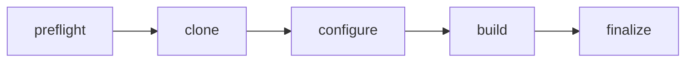
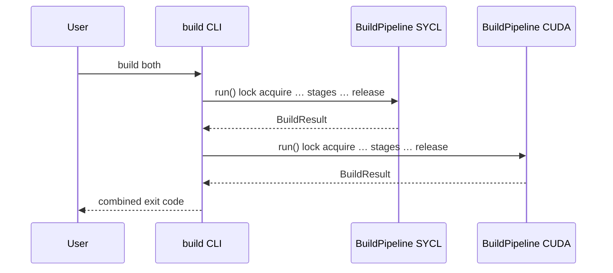

# Build overview

## Purpose

llm-runner builds **only** the `llama-server` target from llama.cpp (via `-DBUILD_SERVER=ON`). Two GPU backends are supported on a single workstation:

| Backend | Hardware target | CMake backend flag | Default build directory |
|---------|-----------------|--------------------|-------------------------|
| **SYCL** | Intel Arc B580 (`SYCL0`) | `GGML_SYCL=ON` | `<source>/build/` |
| **CUDA** | NVIDIA RTX 3090 (`GPU 0`) | `GGML_CUDA=ON` | `<source>/build_cuda/` |

Runtime launch configs (`create_summary_*_cfg`, `create_qwen35_cfg`) point at the resulting binaries under those directories.

## Five-stage pipeline

Every build runs the same ordered stages inside `BuildPipeline.run()`:

| Stage | Role |
|-------|------|
| **preflight** | Verify required toolchain tools for the selected backend |
| **clone** | Shallow-clone or update the llama.cpp git checkout |
| **configure** | Run `cmake -S … -B …` with backend-specific flags |
| **build** | Run `cmake --build …` (parallel `-j` when set) |
| **finalize** | Locate `llama-server`, write `build-artifact.json` provenance |

See [pipeline-stages.md](pipeline-stages.md) for per-stage inputs, skip rules, and failure behavior.

## Entry points

| Surface | Code path |
|---------|-----------|
| CLI | `uv run llm-runner build <sycl\|cuda\|both>` → `llama_cli/commands/build.py` |
| TUI build wizard | `DashboardController` → `run_build_for_backend()` in `build_pipeline/orchestration.py` |
| Library | `BuildPipeline` in `build_pipeline/pipeline.py` |

Both CLI and TUI use the same path conventions: `source/build` and `source/build_cuda` under `Config.llama_cpp_root`, with provenance under `Config.builds_dir/<backend>/`.

## Serialized `both` builds

`llm-runner build both` runs **SYCL first, then CUDA** in a single process loop. Each backend gets its own `BuildPipeline` run, its own lock acquisition/release cycle, and its own provenance file.

- If SYCL fails, CUDA still starts (independent results; exit code 1 if any backend failed).
- There is **no** parallel compile of both backends in one invocation.

### Internal API note

`BuildPipeline.run_both_backends()` exists for tests: it uses alternate build dirs (`build_sycl`, `build_cuda` under a shared parent). **CLI and TUI do not call this method**; they loop single-backend runs with the standard `build` / `build_cuda` layout.

## Source branch and updates

| Setting | Default | Override |
|---------|---------|----------|
| Remote | `https://github.com/ggerganov/llama.cpp.git` | `--git-remote` |
| Branch | `master` | `--git-branch` |
| Shallow clone | yes (`--depth 1`) | `--no-shallow-clone` |
| Update existing clone | yes | `--no-update-sources` |
| Pin commit | none (branch HEAD) | `--git-commit <sha>` |

Preflight does **not** block on llama.cpp API drift; the project tracks `master` by default. Pin a commit when you need reproducible builds.

## No silent auto-build

MVP behavior: **launch does not trigger a build**. If binaries are missing, dry-run and doctor/setup flows surface that; the user must run `build` or the TUI wizard explicitly.

## Retry and locking

- Each stage retries with exponential backoff (`retry_attempts`, `retry_delay` from CLI or `Config`).
- A global lock file (`$XDG_CACHE_HOME/llm-runner/.build.lock`) prevents concurrent builds; stale locks are replaced when the holding PID is gone or the lock age exceeds one hour.

Details: [cli-and-tui.md](cli-and-tui.md), [troubleshooting.md](troubleshooting.md).
