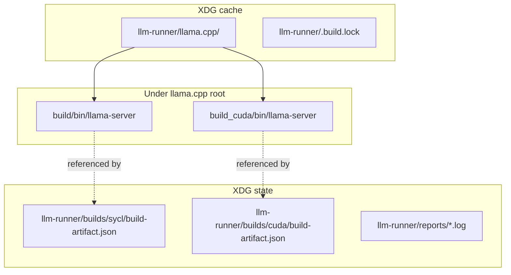

# Paths and artifacts

llm-runner separates **compiled binaries** (under the llama.cpp source tree) from **provenance metadata** (under XDG state). Build logs and failure reports live under a sibling `reports/` directory.

## Layout diagram



## Default paths

Assume `XDG_CACHE_HOME=~/.cache` and `XDG_STATE_HOME=~/.local/state` when unset.

| Artifact | Default path | Purpose |
|----------|--------------|---------|
| Source clone | `$XDG_CACHE_HOME/llm-runner/llama.cpp` | Git checkout; CMake source (`-S`) |
| SYCL build tree | `<source>/build/` | CMake build dir; binary at `build/bin/llama-server` |
| CUDA build tree | `<source>/build_cuda/` | CMake build dir; binary at `build_cuda/bin/llama-server` |
| SYCL provenance | `$XDG_STATE_HOME/llm-runner/builds/sycl/build-artifact.json` | Last successful build metadata |
| CUDA provenance | `$XDG_STATE_HOME/llm-runner/builds/cuda/build-artifact.json` | Last successful build metadata |
| Build lock | `$XDG_CACHE_HOME/llm-runner/.build.lock` | Exclusive build guard (JSON: pid, started_at, backend) |
| Build logs | `$XDG_STATE_HOME/llm-runner/reports/<timestamp>-<backend>.log` | Captured stdout/stderr from configure/build |
| Failure reports | `$XDG_STATE_HOME/llm-runner/reports/<timestamp>/` | Directory with redacted output + artifact JSON on configure/build failure |

`Config` derives runtime binary paths from the source root (unless overridden):

```text
llama_server_bin_intel  →  <llama_cpp_root>/build/bin/llama-server
llama_server_bin_nvidia →  <llama_cpp_root>/build_cuda/bin/llama-server
```

Defined in `llama_manager/config/defaults.py`.

## Environment overrides

| Variable | Effect |
|----------|--------|
| `LLAMA_CPP_ROOT` | Replaces default source path; binaries expected under `build/` and `build_cuda/` inside that root |
| `XDG_CACHE_HOME` | Changes cache base (`llama.cpp` clone, `.build.lock`, venv) |
| `XDG_STATE_HOME` | Changes state base (`builds/`, `reports/` parent) |
| `XDG_DATA_HOME` | Affects `reports_dir` for other features; build logs use `builds_dir.parent / "reports"` |

CLI flags override per invocation:

| Flag | Effect |
|------|--------|
| `--source-dir` | llama.cpp root (same as `LLAMA_CPP_ROOT` for one run) |
| `--build-dir` | Parent for backend subdirs: `<build-dir>/sycl` or `<build-dir>/cuda` when set; otherwise `build` / `build_cuda` under source |
| `--output-dir` | Parent for provenance: `<output-dir>/sycl` or `<output-dir>/cuda`; default `config.builds_dir` |

## `build-artifact.json` schema

Written atomically by `finalize` (success) or referenced from failure reports (failed configure/build). Fields from `BuildArtifact` (`build_pipeline/models.py`):

| Field | Description |
|-------|-------------|
| `artifact_type` | Always `"llama-server"` |
| `backend` | `"sycl"` or `"cuda"` |
| `created_at` | Unix timestamp |
| `git_remote_url` | Clone remote (secrets redacted in logs) |
| `git_commit_sha` | `git rev-parse HEAD` at finalize time |
| `git_branch` | Configured branch name |
| `build_command` | Last `cmake --build` command (or configure command on failure path) |
| `build_duration_seconds` | Wall time for the pipeline run |
| `exit_code` | `0` on success |
| `binary_path` | Path to `llama-server` if found |
| `binary_size_bytes` | File size when binary exists |
| `build_log_path` | Path to consolidated stage log under `reports/` |
| `failure_report_path` | Directory for failure bundle when configure/build failed |

`get_build_status()` reads this file (and falls back to probing default binary paths) for the TUI build panel.

## Binaries vs provenance

**Important:** Provenance JSON does **not** copy the binary into `builds/`. The server executable remains in the source tree; `build-artifact.json` only records where it was found. Launch and dry-run use `Config.llama_server_bin_*` paths directly.

## Legacy shell wrapper paths

[`run_opencode_models.sh`](../../run_opencode_models.sh) hardcodes paths such as `/home/kmk/src/llama.cpp`. That script is a **legacy** launch surface; the Python CLI and defaults use XDG cache unless you set `LLAMA_CPP_ROOT`. Align environment variables if you use both.
